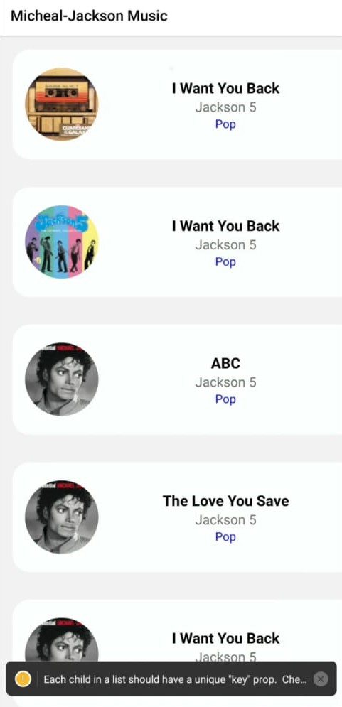
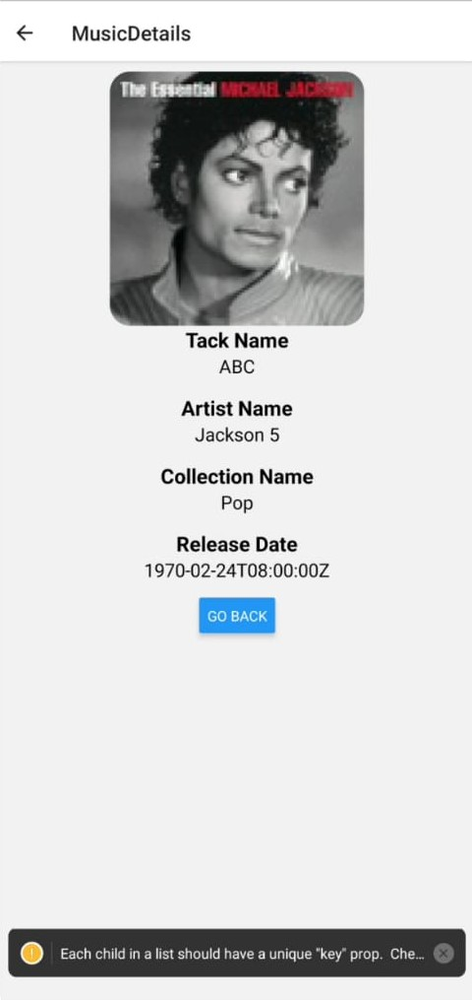

# MusicApp
A task to know about API calling and fetching data from provided Api URL using axios.

## Things that got involved during the task:
1. Use of Axios.
  - How to use Axios, using of GET method to fetch data from Api URL.
  - Use of async and await.
  - How to generate error to UI. For better User-experience.
  - Use of React Hooks(useEffect, useState, useCallback, useMemo).
2. Use of FlatList to render the Data fetched from Api URL.
  - Proper value of keyExtractor.
  - How to add Loader until Api gets fetched.
  - onScroll Loader on flatlist.
3. Props
  - How to uses props inside the routed screens.(how to navigate to detail screen)
4. Params:
  - Get to know the proper value of param, and how to pass it through route.(how to get the clicked Item data to the detail screen)
  
  
## Final Application

**HomeScreen:**

**DetailScreen:**

